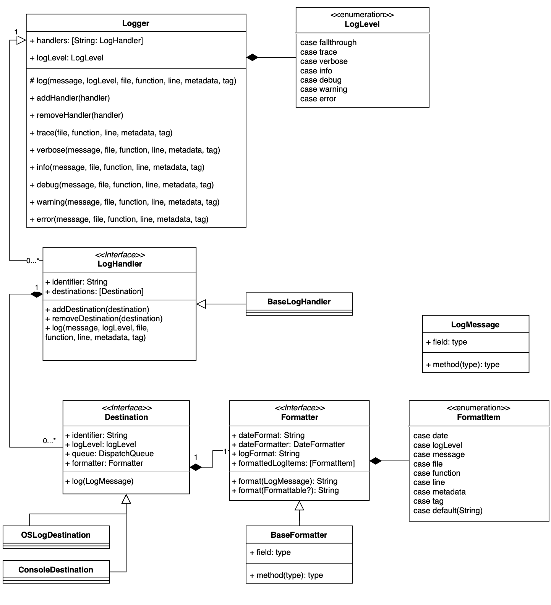
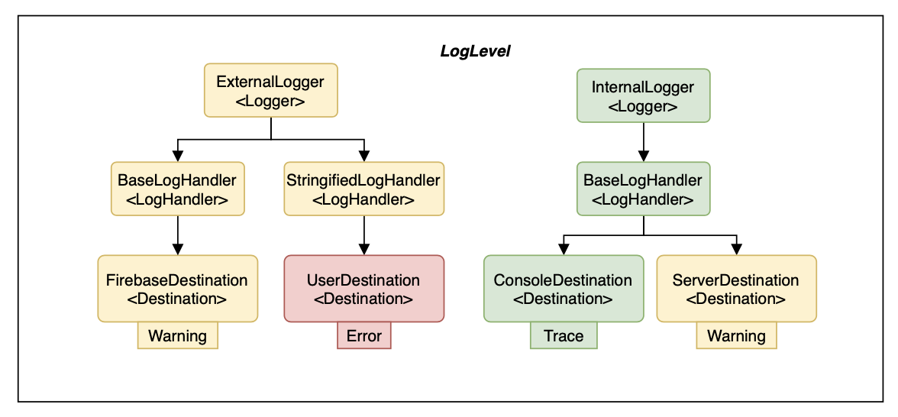

[](https://github.com/sendbird/sendbird-calls-ios) [](https://codecov.io/gh/mininny/Swidoodle)

# Swidoodle

Swidoodle is a logger for Swift that is both easy to use and easily customizable. 

Swidoodle allows you to customize your own output formats, as well as output destination and message types. 

## Installation

>TBD

## Basics

### Using Logger
Swidoodle provides simple logger interface for out-of-the-box usage.

```swift
import Swidoodle

Logger.addDestination(ConsoleDestination(identifier: "myLogger", logLevel: .verbose))
Logger.setLogLevel(.verbose)
Logger.debug("Invoked function")
Logger.error("Fatal Error!")
```

```swift
// output
"2020-06-30 12:43:13 [VERBOSE] Invoked function - #function: #line"
"2020-06-30 12:43:14 [ERROR] Fatal Error! - #function: #line"
```

You can add custom destinations to choose where your logs should be printed at. Swidoodle will use the default formatter to format your message, including the time, log level, function, line, and other information. 

### Design



Swidoodle is composed of 3 components: 
- Logger 
- LogHandler
- Destination

**Logger** is the frontmost interface that you will use to print out your logs. Logger instances contain multiple LogHandlers that distribute your logs to the appropriate destinations

**LogHandler** is the intermediate interface between Logger and Destination. It can be used to primarily customize your logs. You can also separate multiple logs using LogHandler and share them with different Loggers. 

**Destination** is the final interface which delivers the appropriate logs to certain destinations. You can limit the generation of logs to a certain degree by customizing the `logLevel` property, and format your logs to your liking by customizing `Formatter`. You can also subclass `Destination` to customize how you will deliver your logs(i.e. send to server).



## Advanced

### LogLevel
LogLevel allows you to specify the severity of the log message. 
There are 6 levels of severity in Swidoodle.

```swift
public enum LogLevel {
    case trace // For tracing call stack
    case verbose // Verbose messages
    case info // Information useful for tracking
    case debug // Important message for debugging
    case warning // Non-fatal warning critical for debugging
    case error // Important fatal error
}

```

With trace being the lowest level of severity and error being the highest, you should use this value to filter your log messages.

You can set a specific LogLevel to your `Logger` and `Destination`, so your log messages can be filtered two times. 

### Log Message
Log Messsage includes a lot of different data fields. In Swidoodle, there are the following items in the logging API:
- **message**
- date
- *logLevel*
- file
- function
- line
- **metadata**
- **tag**

`date`, `file`, `function`, and `line` will be filled in automatically using Xcode's autocomplete function. 

So you only need to specify `message`, `metadata`, and `tag` when logging a message. 

`logLevel` will be specified when you use the appropriate interface mapped with each log level. For example, Swidoodle provides the following interfaces for your convenience:
```swift
Logger.trace(...)
Logger.verbose(...)
Logger.info(...)
Logger.debug(...)
Logger.warning(...)
Logger.error(...)
```

#### Tag
To categorize logs more easily, Swidoodle provides `Tag`.

Tag has the type of `MetadataValue`, which can be anything from `String`, `Array`, and `Dictionary`. You can use this value to group multiple logs with certain types, or associate certain values with the log. 

#### Metadata
In addition to Tag, Swidoodle also provides `Metadata` to allow more data to be associated with the logs.

Metadata has the type of `[String: MetadataValue]`, which can hold a variety of data types. You can choose to simply print out these metadata, process them in the `Handler`, or parse them indvidually in the `Destination`.

### Formatting Log Message
Formatting Log message hasn't been easier and more straight-forward with Swidoodle. 

On top of the `Formatter`, Swidoodle provides `BaseFormatter` that includes logic for naturally parsing and formatting log messages. 

`BaseFormatter` has `logFormat` property that changes the format of the log. 
Instead of cryptic codes, you can use natural language to format the logs. 

```swift
formatter.logFormat = "logLevel - message : file, date"
"verbose - Log Message : Logging.swift, 2020-06-30 12:43:13+0900"

///

formatter.logFormat = "date [logLevel] message - function: line - metadata, tag"
"2020-07-20 01:12:39+0900 [DEBUG] Log Message - logging_test(): 43 - ["Key": Item, Item2], Tag"
````

| Item | Description | 
|------|-------------|
| date | Date of the log. DateFormat can be customized with `dateFormat` property. | 
| logLevel | Log level of the log. |
| message | String content of the log. |
| file | File where the log was written. |
| function | Function where the log was written. |
| line | Line where the log was written. | 
| metadata | Meatadata associated with the log. |
| tag | Tag associated with the log. |

You can assign `logFormat` any combination of these items, including additional special characters. BaseFormatter will parse the items, and print the logs appropriately. 

Of course, you can customize this as well by overriding `Formatter` yourself. 

### Destinations
Currently, Swidoodle provides `OSLogDestination` and `ConsoleDestination` by default, where `OSLogDestination` outputs logs to Apple's `OSLog` framework, and `ConsoleDestination` prints log to the console. 

If you need more usage, you can easily override `Destination` and implement your own customizations, such as sending the logs to the server. 

You only have to implement `func log(message: LogMessage)` and appropriate variables. 

Example:
```swift
class ServerDestination: Destination {
    var identifier: String
    var queue: DispatchQueue
    var logLevel: Logger.LogLevel
    var formatter: Formatter = BaseFormatter()

    var apiClient: APIClient
    
    init(identifier: String, logLevel: Logger.LogLevel, queue: DispatchQueue = .global(), apiClient: APIClient) {
        self.identifier = identifier
        self.logLevel = logLevel
        self.queue = queue
        self.apiClient = apiClient
    }
    
    func log(message: LogMessage) {
        let formattedMessage = formatter.format(message)
        apiClient.sendLog(formattedMessage)
    }
}
```
